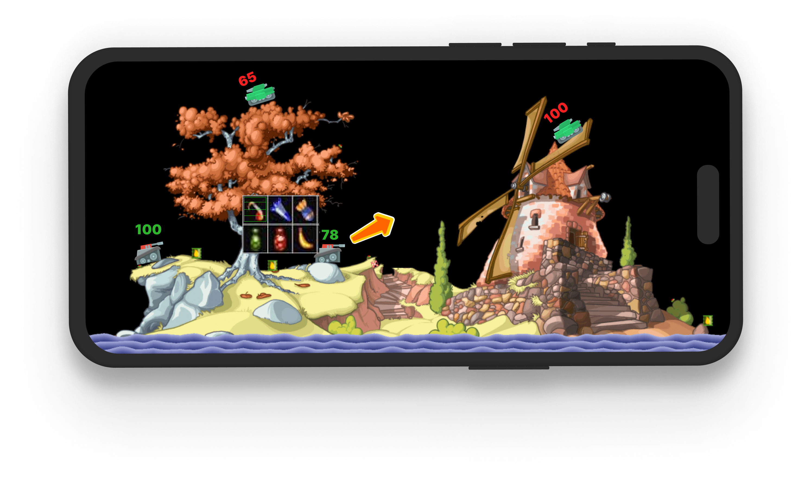
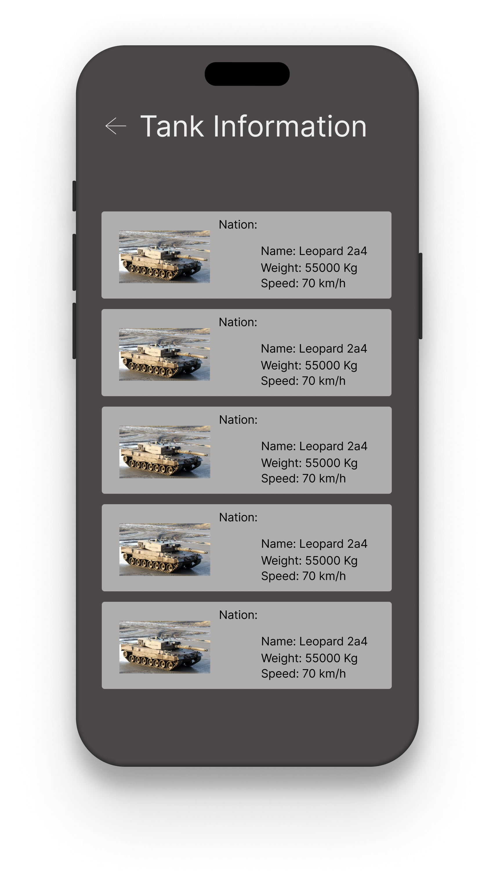

# Tanks
2D tank Game

Tanks Arma Get On 

Erlebe explosive 2D-Action in einem taktischen Panzerspiel, das dich in spannende Schlachten auf verschiedenen Karten führt!

Tanks Arma Get On bietet Spielern die Möglichkeit, in einem rundenbasierten 2D-Kampf gegnerische Panzer zu besiegen. Mit einer Auswahl an Waffen und zerstörbaren Umgebungen fordert das Spiel strategisches Geschick und Zielgenauigkeit. Jeder Treffer auf den Gegner reduziert seine Lebenspunkte, und der letzte überlebende Panzer gewinnt die Schlacht. Hol dir zusätzliche Infos über deine Panzer mit der TankTopia API und behaupte dich in packenden 2D-Gefechten!

Zielgruppe

Für alle, die taktische rundenbasierte 2D-Schlachten lieben und explosive Action erleben wollen.

Design

  
  
  

Features

	•	4 verschiedene 2D-Karten mit zerstörbaren Plattformen
	•	4 Panzer mit grünen Lebenspunkten (Spieler)
	•	4 gegnerische Panzer mit roten Lebenspunkten
	•	Auswahl von 4 Waffen nach Klick auf den Panzer
	•	Treffer reduzieren die Lebenspunkte des Gegners
	•	Zerstörbare Plattformen bei Beschuss
	•	Panzer-Info über API von TankTopia
	•	Sieg- oder Niederlagenbildschirm mit Punkten und Optionen zum Neustart, Panzerwahl oder Beenden

Technischer Aufbau

Projektaufbau

Das Spiel verwendet die MVVM-Architektur, wobei SpriteKit für die 2D-Spielphysik und SwiftUI für die Benutzeroberfläche genutzt wird. Die Panzer und Karten sind als 2D-SpriteKit-Nodes implementiert.

	•	Models: Beinhaltet die Panzer und ihre Eigenschaften (Lebenspunkte, Position).
	•	Views: SwiftUI-Ansichten für den Startbildschirm, den 2D-Spielbildschirm und den Sieg-/Niederlagenbildschirm.
	•	ViewModels: Zuständig für die Verwaltung der Spielzustände (Lebenspunkte, Waffenwahl, API-Abfragen).

Datenspeicherung

Die Datenspeicherung erfolgt mithilfe von Core Data. Dabei werden relevante Spielinformationen wie der Fortschritt des Spielers, Statistiken (Punkte, Siege, Niederlagen), Panzerkonfigurationen und Waffenwahl gespeichert. Core Data wird verwendet, um Daten auch nach Beenden der App zu erhalten.

	•	Core Data-Model: Speichert die Daten des Spiels, z.B. Lebenspunkte, Statistiken und Spielergebnisse.
	•	Vorteile von Core Data: Es ermöglicht eine einfache Datenverwaltung mit wenig Speicheraufwand, unterstützt Offline-Speicherung und Synchronisation bei künftiger Erweiterung auf Cloud-Support.

API Calls

Das Spiel nutzt die TankTopia API, um Informationen über verschiedene Panzer bereitzustellen. Diese Informationen werden im Spiel verwendet, um zusätzliche Details über die Panzer im Panzer-Auswahlbildschirm zu zeigen.

API-Link: https://api.worldoftanks.eu/wot/encyclopedia/tanks/?application_id=DEINE_APPLICATION_ID

3rd-Party Frameworks

	•	SpriteKit: Für die 2D-Spielphysik und das Rendering der Panzer und Karten.
	•	TankTopia API: Um Panzerinformationen bereitzustellen.
	•	Core Data: Für die lokale Speicherung von Spielinformationen und Statistiken.
	•	SwiftUI: Für das Design der Benutzeroberfläche und die Interaktion mit dem Spieler.

Ausblick

In der Zukunft könnten folgende Features implementiert werden:

	•	Mehr Panzer mit individuellen Fähigkeiten
	•	Multiplayer-Modus für 2D-Schlachten mit Freunden
	•	Anpassbare Panzer und Waffen
	•	Neue, interaktive 2D-Karten mit speziellen Hindernissen
